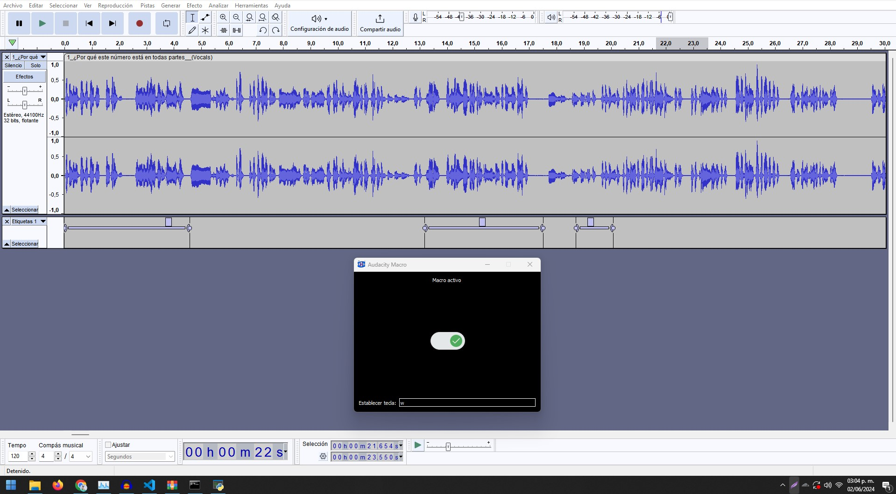

# Macro de Audacity para la División Eficiente de Audio

## Descripción General

Este repositorio contiene un macro basado en Python diseñado para agilizar el proceso de creación de conjuntos de datos o división de archivos de audio en Audacity. El macro automatiza el proceso de presionar `Ctrl + B` para dividir o marcar segmentos de audio, lo cual es típicamente una tarea repetitiva y consumidora de tiempo.

## Características

- **Automatización de Teclas**: El macro simula automáticamente la pulsación de la tecla `Ctrl + B` en Audacity, eliminando la necesidad de entrada manual.
- **Tecla Rápida Personalizable**: Los usuarios pueden establecer una tecla rápida personalizada para activar el macro, mejorando la conveniencia y personalización.
- **Interfaz Amigable**: La aplicación cuenta con una interfaz gráfica de usuario (GUI) simple e intuitiva que indica claramente el estado del macro y permite una configuración fácil.



## Instalación

1. Clona el repositorio:
   ```bash
   git clone https://github.com/hircoir/Audacity-Macro.git
   ```
2. Navega al directorio del proyecto:
   ```bash
   cd Audacity-Macro
   ```
3. Instala las dependencias requeridas:
   ```bash
   pip install -r requirements.txt
   ```

## Uso

1. Ejecuta la aplicación:
   ```bash
   python App.py
   ```
2. Establece la tecla rápida preferida en el campo de entrada proporcionado en la GUI.
3. Activa o desactiva el macro usando el interruptor mostrado en la GUI.
4. Asegúrate de que Audacity esté abierto y activo. Presiona la tecla rápida configurada para activar la acción `Ctrl + B`.

## Licencia

Este proyecto está licenciado bajo la [Licencia MIT](LICENSE).

---

**Nota**: Este macro está diseñado para funcionar con Audacity y requiere que la aplicación esté instalada.
